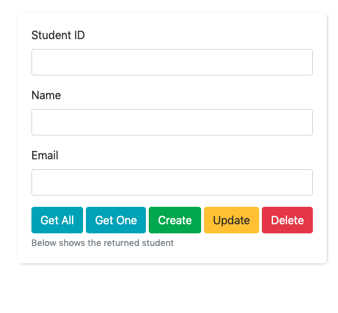
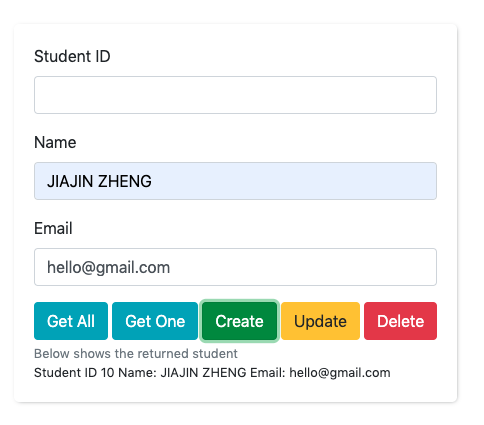
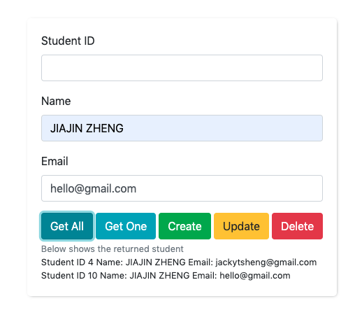

## Simple frontend form to CRUD student

This project requires the [demo student application](https://github.com/jackytsheng/backend-student-demo).
This form realise all the api provided in the backend spring boot project.

### Objective of this project

- To learn practice Jquery.
- To use bootstrap for building up UI form rapidly.
- To familiarise with Ajax API using Jquery.
- To encounter and resolve http transfer issues. eg: CORS issus, Datatype matching issue.

### UI 
Api documentation can be found in the [postman documentation page](https://documenter.getpostman.com/view/9118370/SztJzPVj?version=latest).

UI appearance

Create a student

Get all the students

Delete student by particular ID
